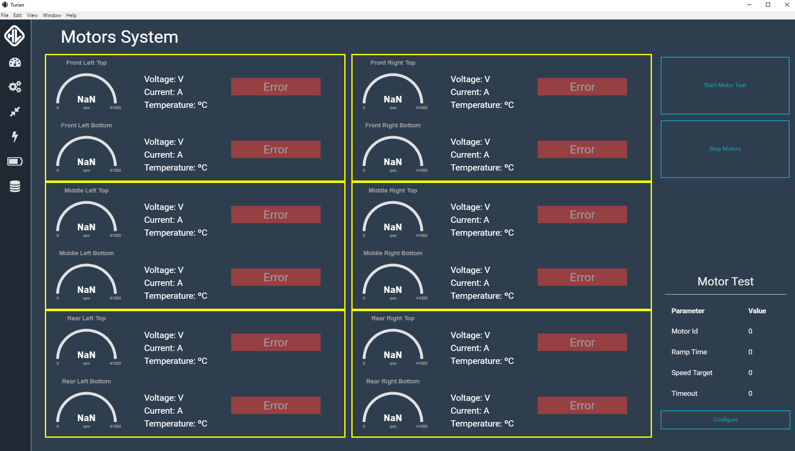
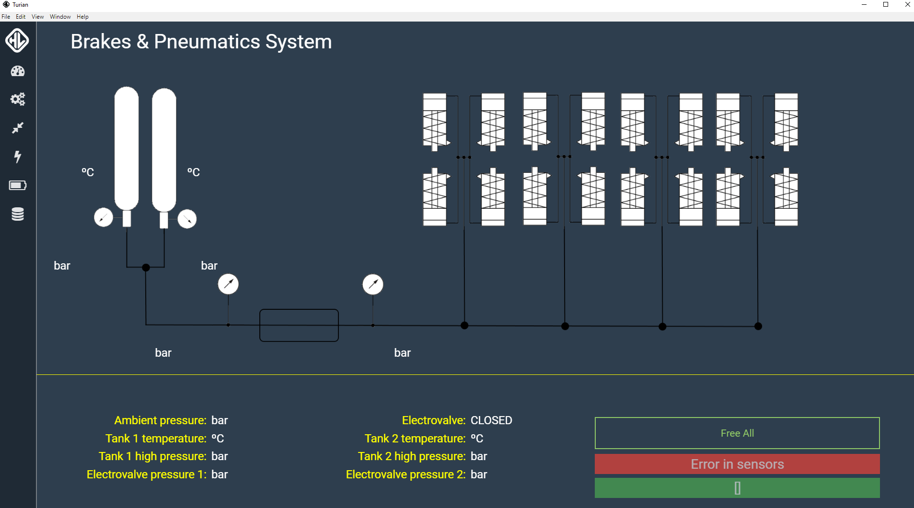
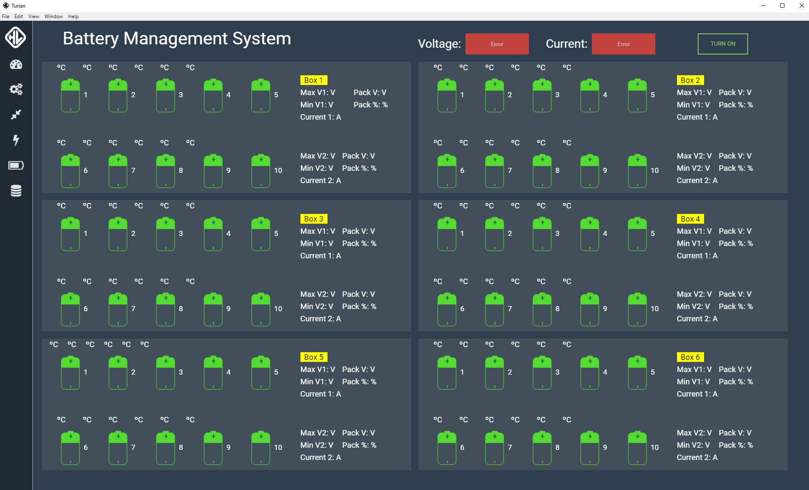
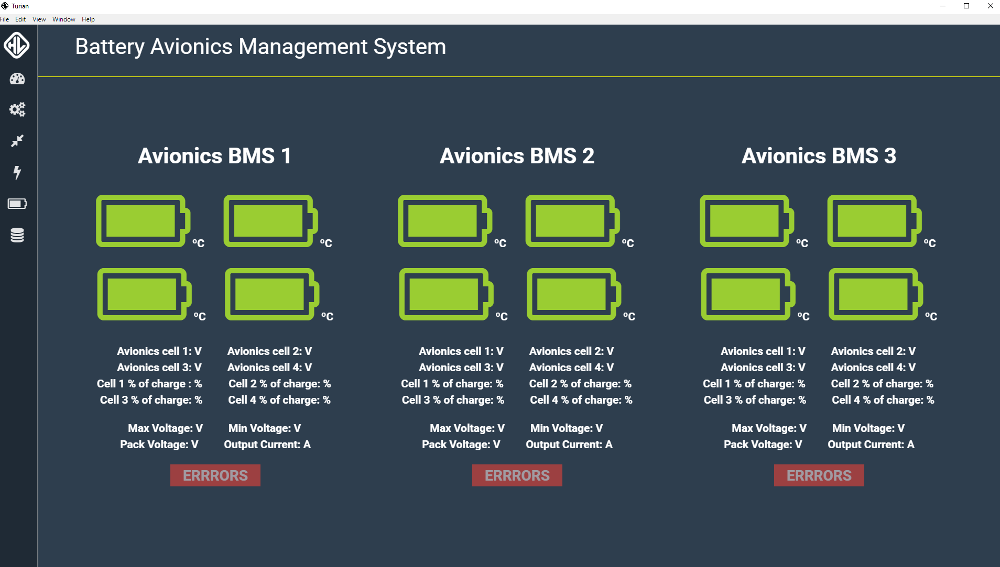
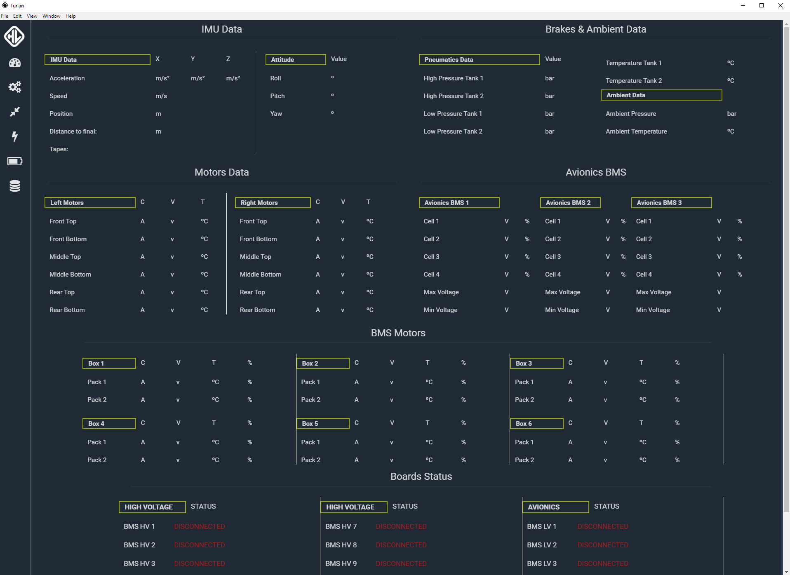

# HyperloopUPV GUI
***

La última versión del **ejecutable** de esta aplicación se encuentra en:
http://hyperloopupv.s3.amazonaws.com/GUI/bundle.zip

Cada commit a la rama master(produccion) se compilara y se subira ahi automaticamente.
***


Para configurar entorno de desarrollo:
Instalar dependencias de node en node_modules
```
npm install
```

Instalar bower de forma global y sus dependencias en public/assets/bower_dependencies
```
npm i bower -g && bower install
```
```
npm start
```

#### Some Screenshoots
The screenshots have been taken with the prototype disconected, so data and graphics are not shown
Main

Motors

Brakes

High Voltage Batteries

Avionics Batteries

Raw Data
